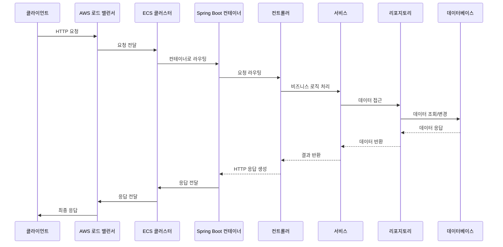

# 2장 - 테스트코드 붙이기

JUnit4 로 테스트를 붙여본다.

## 그 전에 잠시: 메인 클래스

`@SpringBootApplication` 어노테이션을 붙여서 해당 클래스를 프로젝트의 최상단에 두고 구동한다. 이를 통해 내부적인 WAS를 구동시킨다.

아래는 내가 익숙한 환경인 ECS 환경 상에서 어떤 흐름으로 API 통신이 수행되는지를 살펴본다.

## 본격적으로 짜보기

패키지명은 웹 사이트 주소의 역순.

E.g., `admin.s3ich4n.com` 에 대한 패키지 → com.s3ich4n.admin

경로는 기존 코드와 동일하게 두고, 파일명 끝에 `Test`를 붙인다

### 테스트를 구동하려면?

환경설정(Preferences)에서 아래 탭으로 접근한다.

- Build, Execution, Deployment > Build Tools > Gradle

Gradle Projects 창에서 Run tests using란으로 Intellij IDEA를 선택한다

테스트를 구동한다.

## Lombok?

Getter, Setter 뿐 아니라 접근제한자(Access Modifier) 를 어떤 식으로 쓸 수 있게 할지를 어노테이션으로 정해놓을 수 있다

어떤 식의 어노테이션을 쓰는지는 그때그때 잘 보면서 판단하자
