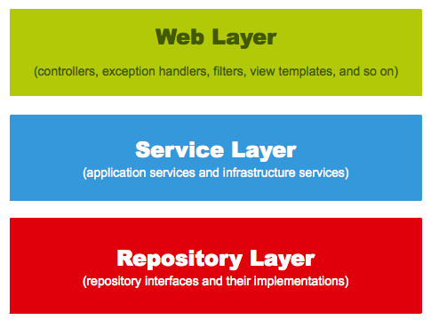

# JPA로 데이터베이스 다루기

iBatis로 SQL 매핑하는 건 때에따라 중요하다! 복잡한 쿼리가 필요하다 싶으면 이걸로 처리해야할 수 있다.

저자는, SQL 쿼리에 골을 싸매는 식으로 개발하다보면 객체지향적 접근을 놓치고 테이블 모델링에 집중됨을 비판한다.

그러면서 동시에 자바 표준 ORM인 JPA를 이야기한다

- JPA는 설계를 위한 스펙이고, JPA 구현체 중 가장 유명한건 Hibernate이다.
- 복잡한 Raw query가 필요하다면 JPQL과 QueryDSL를 적절히 사용해서 풀어낼 수 있다.
- Spring Data JPA 라는 영속성 접근 인터페이스로 데이터베이스에 접근할 수 있다.
  - MongoDB용, Redis용 기타 등등 다른 Spring Data 모듈 또한 존재한다.

이어서 JPA 기반의 장점을 지속적으로 소개한다.

- 객체기반으로 코드를 설계하고 매핑하면, 반복되는 코드를 줄일 수 있다.
    - 매핑된 코드는 iBatis의 쌩쿼리 반복을 최소화할 수 있다.
    - (1번 문제) RDBMS 의 데이터베이스 모델링 패러다임과, 객체지향적 프로그래밍의 간극을 최소화할 수 있다

## 나의 생각

그런데 잘 생각해보면, 복잡한 비즈니스 로직을 치밀하게 짜는 것 자체부터가 굉장히 힘든 접근이다.
이럴 때는 객체지향적 접근을 통해 객체간 역할, 책임을 나누고 이걸 어디에 영속화할지 고민하는게 백번 옳다고 생각한다.

혹자는 말한다.

> '단순한 도메인에서는 그래도 될까?' 

> '간단한 도메인에선 굳이 그럴 필요가 없다. 프로덕트가 빨리 나오는 것에 집중해야한다'
 
동의한다. 프로그래머는 프로그램을 만드는 사람이니까.
하지만, 확장가능한 디자인을 공부하고 이를 도입할 준비를 해보고 써보는 시도자체는 필요하다.

그런데 또 복잡한 쿼리(테이블이 열몇개씩 동시에 조인되는?!)에도 적합하지 않다.

프로그래밍에는 정답이 없다지만, 오답(잘못된 선택으로 인해 야근하는 등)을 걸러내기 위해 학습해두자

### 1번 문제

이거로 장점을 제대로 얻기 위해선 객체지향 자체를 제대로 이해해야하고 RDBMS 설계 자체도 빠삭해야한다.

"도메인" 이라는 말의 무게가 무겁다. 왕관과 같아서, 올바르게 써야 위엄이 선다.

많은 책을 읽고 판단하자.

# 다시 책 내용으로

게시판을 만들어봅시다.

주요기능

- 게시판
  - 게시글 조회
  - 게시글 등록 
  - 게시글 수정
  - 게시글 삭제
- OAuth 2로 로그인
  - 내 글 쓰기
  - 내 글 권한 관리

## 도메인 담기

책에서 말하는 건, repository layer, DTO, 도메인 모델을 말한다.

서비스에서 표현하고싶은 핵심 개념이 어떤 동작이 필요로 하는지(도메인 스토리텔링)를 도출하고, 이를 코드로 옮기고 이에 대한 테스트코드를 쌓아올려서 서비스를 쌓는다. (반드시 DB 테이블과 관계가 있어야 할 필요는 없다)

서비스 레이어는 도메인 내의 순서를 보장하고 이를 처리한다.

DTO는 DB layer와 따로 놀아야된다. Entity에서 쓰는 클래스와 Controller에서 쓰는 클래스는 분리해서 쓰는 것이 좋다.

## auditing

`createDatetime`, `modifiedDatetime`을 아예 상속받게 해서 쓸수도있다

질문: 자바는 다중상속이 안 되니까 이런 요소들을 인터페이스로 하고 심는것도 생각하면 좋은가?

파이썬에서의 mixin하고 비슷하게 생각하면 된다

---

# 참고하기

## H2 설정값을 추가하고 DB 내용을 보려면?

Spring boot 켜질 때의 로그를 잘 살펴보기

```log
(생략)
2024-05-18T22:08:19.247+09:00  INFO 219678 --- [s3ich4n-springboot-study-01] [           main] o.s.b.a.h2.H2ConsoleAutoConfiguration    : H2 console available at '/h2-console'. Database available at 'jdbc:h2:mem:0183fc63-5c47-4bf2-8be1-a9d7988576e3'
(중략)
```

어떻게 돌아가는건지 처음 로그를 쭉 읽어봤더니 이런 식으로 다 알려준다.

`/h2-console` 로 들어가서 DB 주소를 저 값으로 주면 된다.



[^2]: [링크 출처](https://www.petrikainulainen.net/software-development/design/understanding-spring-web-application-architecture-the-classic-way/)